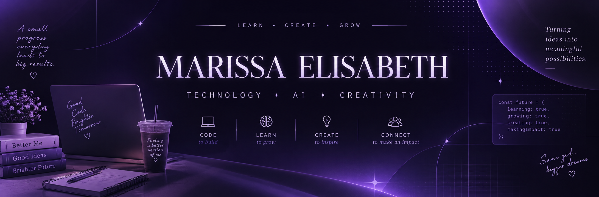

# Hi, I'm Marissa Elisabeth 👋

### Information Systems & Technology Student

**AI & Technology • Web Development • Digital Creativity**

 

*Curious to learn, excited to create, and always looking for ways*
*technology can turn ideas into something meaningful.*

---

## 👩🏻‍💻 About Me

I'm an Information Systems & Technology student at **Institut Teknologi dan Bisnis Sabda Setia** with a strong interest in **Artificial Intelligence, technology, and digital innovation**.

I'm currently developing my skills in **programming and web development**, while also exploring areas such as **digital marketing, content creation, and creative technology**.

I enjoy learning through hands-on projects, experimenting with different tools, and discovering how technology can be used to create useful and meaningful things.

I'm still learning and growing, but I believe that every project, experiment, and new experience is another step forward.

---

## 🌱 Currently Exploring

- 🤖 Artificial Intelligence & Generative AI
- 💻 Programming & Web Development
- 🌐 Digital Technology & Innovation
- 🎨 Digital Marketing & Content Creation
- 🎤 Public Speaking & Communication

---

## 🛠️ Tools & Technologies

### 💻 Development

  
  
  

### 🤖 AI & Technology

  
  

### 🎨 Design & Content

  
  
  

### 🧰 Development Tools

  
  
  
  

---

## 🚀 Featured Projects

A collection of projects, academic work, and experiments from my learning journey.

### 🌐 Web Development

**Web development exercises and academic projects**

Projects created while developing my understanding of web programming and building websites through hands-on practice.

**Focus:** HTML • CSS • JavaScript

---

### ☕ Coffee Project

A programming project created as part of my learning journey in developing applications and working with technology.

**Focus:** Programming • Application Development

---

### 📚 Academic Projects

A collection of projects and exercises developed throughout my studies in Information Systems & Technology.

These projects represent my ongoing process of learning, experimenting, and improving my technical skills.

---

## 🏅 Learning Journey

Some of the learning experiences that have contributed to my journey in technology:

| Course / Program | Organization |
|---|---|
| 🤖 Belajar Dasar AI | Dicoding |
| 💻 IT - AI Agent for Programming | IBM SkillsBuild |
| 🧠 Maximizing the Use of ChatGPT | MySkill |
| 🎨 Masterclass Canva AI | SGB VA |

> Every certificate represents not an endpoint, but another step in the learning process.

---

## 🎓 Education

**Institut Teknologi dan Bisnis Sabda Setia**

Information Systems & Technology

---

## 💭 My Learning Philosophy

### Learn something new.
### Create something meaningful.
### Grow through every experience.

---

## 🤝 Let's Connect

I'm always open to connecting with people who are interested in:

**Technology • AI • Creativity • Learning • Innovation**

  

⭐ Thanks for visiting my profile!

